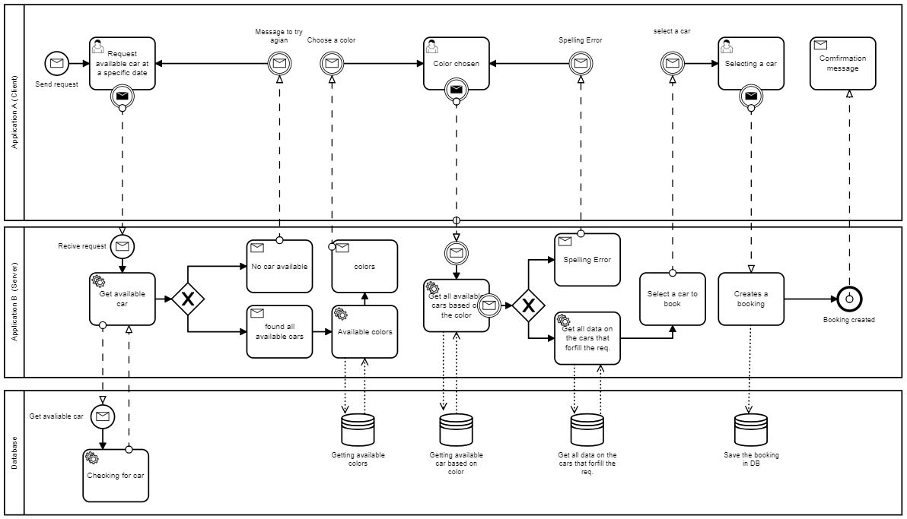

# Mini-Project-2-enterprise-integration-patterns

The main objective of this project is to improve practical experience in implementing integrating enterprise applications by use of integration platforms and middleware.

## Getting Started

These instructions will get you a copy of the project up and running on your local machine for development and testing purposes.

### Prerequisites
Software needed for running this project

- Install RabbitMQ (https://www.rabbitmq.com/download.html)
- Install Visual studio 2019 (https://visualstudio.microsoft.com/downloads/)

### Setup Instructions
- Download this repository
- Open both the client and server with Visual studio 2019
- Change file paths to the direction your project is installed (There are 2 paths to adjust, both located in Receive.cs)
	- Mini-Project-2-enterprise-integration-patterns -> MiniProject2Server -> Receive.cs
- Start RabbitMQ
- Run Server and the Client afterwards
	
## BPMN
**Take a look at our BPMN model to understand the functionality of our program.**
	
	
## Intergration Patterns we cover

### Message Channel

### Message

### Splitter

### Aggregator

### Request-Reply

