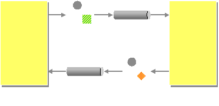

# Mini-Project-2-enterprise-integration-patterns
## Setup Instructions
	- Install RabbitMQ (https://www.rabbitmq.com/download.html)
	- Download this repository
		- Open both the client and server with Visual studio 2019
			- Change file paths to the direction your project is installed
	- Start RabbitMQ
	- Run Server and the Client afterwards
	
## BPMN
	- Take a look at our BPMN model to understand the functionality of our program.
	
## Intergration Patterns we cover
	Message Channel
	
	Message
	
	Splitter
	Aggregator
	
	Request-Reply

